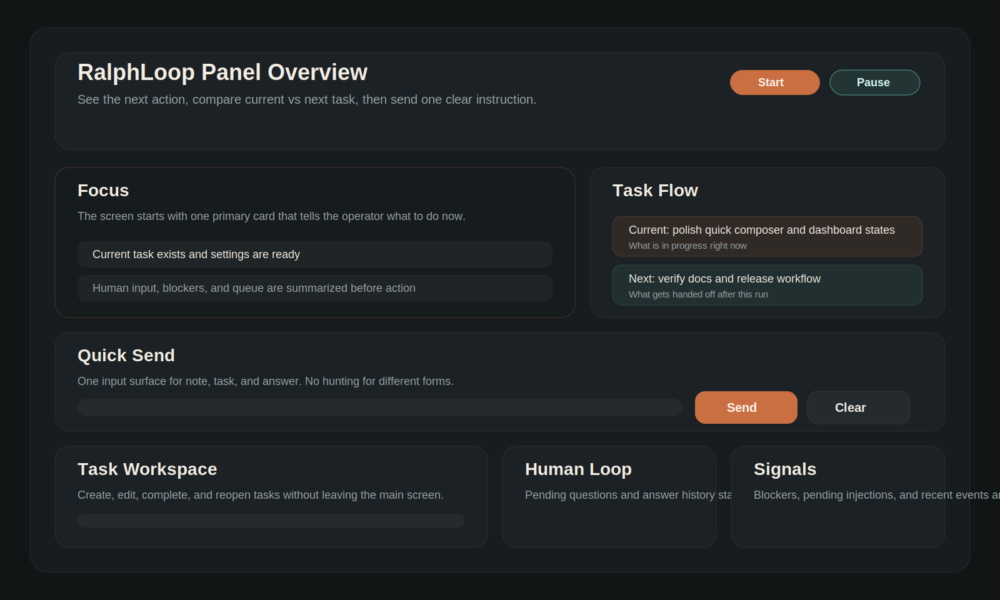

# RalphLoop v1.1

Task を起点に Codex 実行を監督する、operations-first の orchestration loop です。  
`ralph` を常駐サービスとして動かし、Web panel / supervisor / Discord bridge を同じ state と action layer で扱います。

## English TL;DR

RalphLoop is a task-first orchestration loop for Codex. It keeps one shared state across the web panel, supervisor, and Discord bridge, so you can always see the current task, the next handoff, and what still needs human input.

If you just cloned this repo, run `./ralph` from the repository root. If you want a global `ralph` command on your machine, use `npm link`.



RalphLoop が狙っているのは、単に `codex exec` を繰り返すことではなく、次の 3 点を常に見失わない運用です。

- いま何を進めているか
- 次に何へ渡すか
- 人間の判断をどこで差し込むか

## 何ができるか

- `ralph` ひとつで `start / run / start-run / configure / panel / supervisor / discord / demo / status / check` を扱える
- panel で `現在の Task / 次の Task / 要対応 / 実行設定 / 実行制御` を 1 画面で見られる
- Task が多いときだけ `MaxIntegration` を自動で増やし、レーン表示に反映する
- Task を panel 上で最優先へ上げたり後ろへ回したりできる
- 質問が未回答でも loop は止めず、回答は次ターン prompt に一度だけ注入する
- Web と Discord が同じ action layer を使うので、どこから触っても state がぶれない
- state / log は JSON / JSONL / flat file のみで扱う

## 60 秒で試す

前提:

- Node.js 24 以上
- Codex CLI を使うなら `codex` コマンドが通ること

```bash
npm run check
./ralph demo
```

これで以下を確認できます。

- `http://127.0.0.1:8787` に panel が立つ
- demo agent が `[[QUESTION]]` を出す
- panel から回答すると次ターン prompt に注入される
- demo agent が `[[DONE]]` を返して完了する

## 本番運用の始め方

1. `.env.example` をベースに `.env` を用意する
2. `npm run check` で設定不備を潰す
3. `./ralph` で常駐サービスを起動する
4. panel か Discord で最初の Task を作る
5. `実行開始` で 1 run を回し、完了した Task を次の Task へ渡す

```bash
cp .env.example .env
npm run check
./ralph
```

Discord token が未設定なら Discord bridge は自動で無効化され、Web only モードで起動します。
`agentCommand` は既定で起動時設定に固定され、panel / Discord からは変更できません。必要な場合だけ `RALPH_ALLOW_RUNTIME_AGENT_COMMAND_OVERRIDE=true` を明示的に設定してください。

最小構成のサンプルは [examples/minimal/README.md](./examples/minimal/README.md) にあります。

## 主要コマンド

```bash
./ralph
./ralph start
./ralph run "repo-wide rebuild"
./ralph start-run "repo-wide rebuild"
./ralph configure --max-iterations 40 --idle-seconds 3
./ralph status
./ralph check
./ralph demo
./ralph panel
./ralph supervisor
./ralph discord
```

補足:

- clone 直後は repo 直下の `./ralph` を使うのが最短です
- `npm link` 済みなら `ralph` としても実行できます
- `./ralph` と `./ralph start` は同義です
- `./ralph run` はサービス起動と同時に 1 回だけ run をキックします
- `./ralph start-run` は既に起動している service へ queued run を追加します
- `./ralph check` は prompt / task catalog / panel / Discord 設定の診断だけを行います
- `npm run dev` は `./ralph start` の thin wrapper です
- 依存パッケージを使っていないので、通常は `npm install` は不要です

## Web panel の考え方

panel は「全部の情報を並べる画面」ではなく、次の視線順を前提に組んでいます。

1. いまやることを見る
2. 現在と次の Task を比較する
3. 1 つの送信口からメモ / Task / 回答を送る

主な要素:

- `いまやること`: state から次の一手を要約
- `現在と次`: 今回の run で進める Task と、次回へ渡す Task
- `クイック送信`: メモ / Task 追加 / 質問回答を 1 つの入力欄に集約し、送信前プレビューと下書き自動保存を持つ
- `Task ワークスペース`: 編集、完了チェック、未完了への戻し、優先順位の前後移動
- `人の確認待ち`: 未回答の質問と回答履歴
- `要対応と最近の動き`: Blocker、差し込み待ち、イベント

## Discord bridge

Discord token を設定すると gateway bot として動作します。

通知:

- 実行開始
- `[[STATUS]]`
- `[[QUESTION]]`
- `[[BLOCKER]]`
- `[[DONE]]`

操作:

- `/help`
- `/start`
- `/status`
- `/config`
- `/pause`
- `/resume`
- `/abort`
- `/tasks`
- `/task-add タイトル | 説明`
- `/task-edit T-001 タイトル | 説明`
- `/task-done T-001`
- `/task-reopen T-001`
- `/answer Q-001 staging を優先してください`
- `/note 次ターンは panel 完成を優先`
- `/set-task repo-wide rebuild`
- `/set-iterations 40`
- `/set-idle 3`
- `/set-mode command`
- `/set-prompt-file /abs/path/to/prompt.md`
- `/set-prompt ここに prompt 上書きを書く`
- `/clear-prompt`

`/set-agent` は既定では無効です。`RALPH_ALLOW_RUNTIME_AGENT_COMMAND_OVERRIDE=true` を設定したときだけ登録されます。

## `ralph check` で確認すること

`./ralph check` は以下を診断します。

- Task 名が空でないか
- `promptFile` が存在するか
- 通常実行で `agentCommand` が空でないか
- task catalog が設定されている場合、実ファイルが存在するか
- panel host / port が有効か
- Basic 認証が片側だけ設定されていないか
- runtime `agentCommand` 変更を有効にした場合の保護設定が足りているか
- Discord token や通知先が揃っているか

JSON が必要なら `./ralph check --json` が使えます。

## 回答待ちでも止めない

このツールの運用ポリシーです。

1. agent が `[[QUESTION]]` を出しても supervisor は止まらない
2. 質問は `state/questions.json` に pending として保存される
3. 回答は `state/answers.json` に保存される
4. 次ターン開始前に未注入 answer / note を収集する
5. prompt 末尾へ自然文で一度だけ差し込む

## Task の進め方

このツールは「全部の Task を一気に潰す」よりも、「1 run で 1 Task を確実に前へ進める」運用に向いています。

1. 最初の Task を作る
2. Ralph は現在の Task を中心に進める
3. 完了したらチェックを付ける
4. 画面上に次の Task が前に出る
5. 次の run はその Task から始める

## State / Log

デフォルトのファイル:

```text
state/status.json
state/questions.json
state/answers.json
state/manual-notes.json
state/blockers.json
state/tasks.json
state/settings.json
state/answer-inbox.jsonl
state/note-inbox.txt
logs/events.jsonl
logs/agent-output.log
```

ローカル file fallback:

- `state/answer-inbox.jsonl`

```json
{"questionId":"Q-001","answer":"staging を優先してください"}
```

- `state/note-inbox.txt`

```text
テストより先に panel の確認を優先してください
```

## Task catalog / PRD の作り方

`RALPH_TASK_CATALOG_FILE` には、`userStories` 配列を持つ JSON を渡します。  
「PRD の書き方が分からない」「README や issue しかない」という状態でも、先に文章を作り込む必要はありません。

最小の考え方:

- 1 story = 1 run で前進させたい単位
- title は短く、description は agent が次にやることまで読める長さにする
- 実装順に並べる
- 不明点は無理に埋めず、description に制約や判断材料として書く

詳しい書き方とテンプレートは [docs/task-catalog.md](./docs/task-catalog.md) にあります。

README / GitHub URL / 仕様メモしかない場合は、そのまま ChatGPT や Codex に渡して `prd.json` を作らせる運用で十分です。  
panel の import preview に貼って、内容を確認してから Task 化できます。

## テストと検証

```bash
npm run lint
npm test
npm run check
npm run smoke
npm run build
```

GitHub Actions でも `lint / test / check / smoke / build` を回しています。

## 設計メモ

設計の意図は [ARCHITECTURE.md](./ARCHITECTURE.md) にあります。  
v1.1 の変更点は [CHANGELOG.md](./CHANGELOG.md) にまとめています。

## Repo Guide

- English guide: [README.en.md](./README.en.md)
- 最小セットアップ: [examples/minimal/README.md](./examples/minimal/README.md)
- Task catalog / PRD guide: [docs/task-catalog.md](./docs/task-catalog.md)
- 設計: [ARCHITECTURE.md](./ARCHITECTURE.md)
- リリース手順: [docs/releasing.md](./docs/releasing.md)
- コントリビュート: [CONTRIBUTING.md](./CONTRIBUTING.md)
- サポート: [SUPPORT.md](./SUPPORT.md)
- セキュリティ連絡: [SECURITY.md](./SECURITY.md)
- 行動規範: [CODE_OF_CONDUCT.md](./CODE_OF_CONDUCT.md)

## ライセンス

[MIT](./LICENSE)
